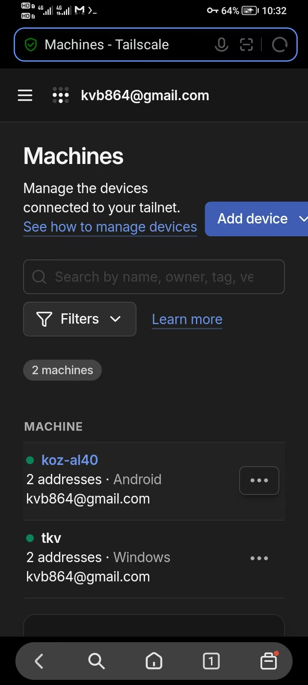

## 第一阶段：先在局域网里跑通

这一阶段，我们先确保手机和电脑连同一个 WiFi 时，手机能够 SSH 进 WSL，至于 SSH 是什么，最后会进行讲解。

### 1.WSL 安装 SSH Server

在 WSL 里：

```bash
sudo apt update
sudo apt install openssh-server
```

启动：

```bash
sudo service ssh start
```

或者如果你的 WSL 开了 systemd：

```bash
sudo systemctl enable --now ssh
```

检查：

```bash
sudo systemctl status ssh
```

再确认 22 端口：

```bash
ss -tlnp | grep ':22'
```

理想情况应该看到类似于：

```bash
LISTEN 0 128 0.0.0.0:22
```

### 2.把 WSL2 网络改成 mirrored

这是现在 Windows 11 + WSL2 比较适合当前场景的方式。

微软目前明确支持 WSL2 的 mirrored 网络模式，它可以让 WSL **直接从 LAN 被访问**，而不必像传统 NAT 模式那样折腾 WSL IP + Windows netsh portproxy，这些名词后续都会进行讲解，现在先实践。

[微软 WSL 网络官方文档](https://learn.microsoft.com/en-us/windows/wsl/networking?utm_source=chatgpt.com)

在 Windows：

```bash
C:\Users\<WINDOWS_USER>\.wslconfig
```

加入：

```bash
[wsl2]
networkingMode=mirrored
```

<WINDOWS_USER> 为你的 Windows 用户名，比如一个五位数字。后文均用 <WINDOWS_USER> 表示。

如果没有 .wslconfig 文件，在 wsl 的 `/mnt/c/Users/<WINDOWS_USER>` 目录下执行：

```bash
cat > /mnt/c/Users/<WINDOWS_USER>/.wslconfig << 'EOF'
[wsl2]
networkingMode=mirrored
EOF
```


如果已经有 `[wsl2]`，就不要重复写 section，直接加入：

```bash
networkingMode=mirrored
```

查看 .wslconfig 文件，确认进行了修改：

```bash
cat /mnt/c/Users/<WINDOWS_USER>/.wslconfig
```

应该输出：

```bash
[wsl2]
networkingMode=mirrored
```

然后 PowerShell：

```powershell
wsl --shutdown
```

重新打开 WSL

Mirrored 模式需要 Windows 11 22H2+，它还能改善 VPN、IPv6 和 Windows/WSL 网络互通。


### 3.找到电脑IP

重新进入 wsl 以后执行：

``` bash
ss -tlnp | grep ':22'
```

确认还是：

```bash
0.0.0.0:22
[::]:22
```


然后我们检查 mirrored 是否生效

在 WSL 里执行：

```bash
ip addr
```


找到当前使用的局域网接口，关注其中 `inet` 后面的 IPv4 地址。本次环境对应接口为 `eth2`：

```bash
inet <LAN_IP>/<PREFIX_LEN> brd <BROADCAST_IP> scope global noprefixroute eth2
```

例如：

```bash
inet 192.168.110.168/24 brd 192.168.110.255 scope global noprefixroute eth2
```


同时 Windows PowerShell 执行：

```powershell
ipconfig
```


关注：

```powershell
IPv4 地址 . . . . . . . . . . . . : <LAN_IP>
子网掩码 . . . . . . . . . . . . : <SUBNET_MASK>
```

例如：

```bash
IPv4 地址 . . . . . . . . . . . . : 192.168.110.168
子网掩码 . . . . . . . . . . . . : 255.255.255.0
```

可以看到Windows WLAN 和 WSL `eth2` 现在拿到了**完全相同的局域网地址**：

```bash
Windows WLAN
192.168.110.168/24

WSL eth2
192.168.110.168/24
```

注：子网掩码 255.255.255.0，就表示 /24


而且 WSL 的 SSH 已经：

```
LISTEN 0.0.0.0:22   
LISTEN [::]:22      
```

所以现在的目标非常明确：

```
Android
   │
   │ Wi-Fi / LAN
   │
   ▼
<LAN_IP>:22
   │
   ▼
WSL sshd
```

另外，如果在 powershell 里执行 ipconfig 后看到有未知适配器 SakuraiTunnel：

```
198.18.0.1/30
```

注：即展示：

```powershell
IPv4 地址 . . . . . . . . . . . . : 198.18.0.1 
子网掩码 . . . . . . . . . . . . : 255.255.255.252
```

WSL 里也出现：

```
eth0 → 198.18.0.1/30
```

这进一步说明 mirrored 确实把 Windows 的网络接口镜像进 WSL 了。现在代理如果正常，暂时不要动任何代理配置。


### 4.开放 WSL SSH 入站

用管理员身份打开 Powershell，执行：

```powershell
New-NetFirewallHyperVRule `
  -Name "WSL-SSH" `
  -DisplayName "WSL SSH" `
  -Direction Inbound `
  -VMCreatorId '{40E0AC32-46A5-438A-A0B2-2B479E8F2E90}' `
  -Protocol TCP `
  -LocalPorts 22
```

注：管理员身份打开 Powershell 有两种方式：

方式一：点击 windows 图标或直接按键盘上的 win 键，搜索 Powershell，点击以管理员身份运行。

方式二：按下 win+R 后，输入 powershell，然后同时按下 Ctrl + Shift，再按回车。

这是针对 mirrored WSL 的 Hyper-V 防火墙规则。微软文档也说明，mirrored 模式下从 LAN 直接访问 WSL 时，需要允许相应 Hyper-V 防火墙入站流量。[Microsoft WSL mirrored networking 文档](https://learn.microsoft.com/en-us/windows/wsl/networking?utm_source=chatgpt.com)

执行成功后，可以检查：

```
Get-NetFirewallHyperVRule -Name "WSL-SSH"
```

看几个关键字段：

```bash
Direction         : Inbound
Protocol          : TCP
LocalPorts        : 22
Action            : Allow
Enabled           : True
EnforcementStatus : OK
```

如果等于这些值，说明没问题了，可以进入手机连接测试了

### 5.安卓安装 Termux 

先确保手机和电脑连接的是同一个 Wi-Fi，电脑当前局域网地址是 <LAN_IP>（在第三步：查看电脑IP中已查看）：

在浏览器中搜 Termux ，找到 Termux 的 github 仓库，选择 .apk 文件下载即可。这里直接提供仓库地址：https://github.com/termux/termux-app


### 6.进行 SSH 连接

进去以后：

```bash
pkg update
pkg install openssh
```

然后：

```bash
ssh <WSL_USER>@<LAN_IP>
```

把：

```bash
<WSL_USER>
```

换成你 WSL 里面：

```bash
whoami
```

得到的用户名，当然你也可以直接看到你 wsl 里显示的名字。下文均用 <WSL_USER> 表示。

第一次连接应该会出现类似：

```bash
The authenticity of host '<LAN_IP>' can't be established.
...
Are you sure you want to continue connecting (yes/no/[fingerprint])?
```

输入 yes 即可。

如果没有出现了错误，检查一下你的手机和电脑是否连接了同一个 WiFi

接下来：

```bash
<WSL_USER>@<LAN_IP>'s password:
```

这里输入的是你的 WSL Ubuntu 用户的密码，不是 Windows PIN。

如果成功，你手机上的 Termux 提示符就会从 Android 环境变成类似：

```
<WSL_USER>@<WINDOWS_USER>:~$
```

这意味着链路已经彻底打通：

```
Android Termux
      │
      │ SSH
      ▼
   <LAN_IP>
      │
      ▼
   WSL2 Ubuntu
      │
      ├── codex
      ├── claude
      ├── pi
      └── tmux
```

走到这里，第一阶段的任务就完成了，我们实现了在同一 WiFi 下，手机能够连接到电脑的 wsl


## 第二阶段：改造成真正适合长期使用的环境


### 1.SSH Key 免密登录

先退出手机当前的 WSL SSH，有两种方式：

方式一：输入 exit 并回车

方式二：点击 Ctrl，看到 Ctrl 由白色变为红色（模拟电脑键盘中按住 Ctrl 的状态），点击键盘中的字母 d，即可退出。不难注意到如果你的点字母 d 真的生效了，那么 Ctrl 会从红色变成白色。

Ctrl+D 会向当前交互式 Shell 表示 EOF，Shell 通常因此退出；当前场景下远程 Shell 结束后 SSH 会话随之关闭，因此回到 Termux。它并不是 WSL 专属的退出快捷键。

确认回到 Termux 自己的 shell 后，在**手机 Termux**执行：

```bash
ssh-keygen -t ed25519
```

它会问：

```bash
Enter file in which to save the key (.../.ssh/id_ed25519):
```

直接回车。

然后：

```bash
Enter passphrase (empty for no passphrase):
```

为了达到手机快速接管 Agent 的目的，你可以直接回车不设置 passphrase，再确认一次回车。

生成完后执行：

```bash
ssh-copy-id <WSL_USER>@<LAN_IP>
```

这一次会要求你最后输入一次 WSL 密码。

完成后测试：

```
ssh <WSL_USER>@<LAN_IP>
```

如果这次不需要密码直接进入 WSL，免密登录就配置成功了。

### 2.tmux 持久会话

目标是：即使手机锁屏、Termux 被切后台、SSH 断开，Codex/Claude Code 仍然继续运行。

先在手机 SSH 进入 WSL：

```bash
ssh <WSL_USER>@<LAN_IP>
```

确认 tmux 已安装：

```bash
tmux -V
```

如果没有：

```bash
sudo apt install tmux
```

然后我们直接拿一个真实项目测试。比如：

```bash
cd ~/projects/epsilon
tmux new -s epsilon
```

此时你已经进入一个名为 `epsilon` 的持久终端。在里面启动 codex，即输入：

```bash
codex
```

现在可以正常在手机上操作 Codex。

关键来了：**不要 exit Codex**，而是点击 Ctrl，变红之后按键盘中的字母 b，然后按字母 d，注意是CTRL（变红） → b → d，而不是CTRL → b → 松开 → CTRL → d 

即 tmux 的 detach，也就是说如果当前已经回到 tmux 内的 shell，可以执行 `tmux detach`

如果正在 Codex/Claude Code 等前台程序中，则使用 `Ctrl+B → d`，或 `Ctrl+B → 输入冒号 → detach-client`

此时应该回到普通 SSH Shell，并看到类似：

```bash
[detached (from session epsilon)]
<WSL_USER>@<WINDOWS_USER>:~$
```

此时执行：

```bash
tmux ls
```

应该有：

```bash
epsilon: 1 windows (...)
```

然后重新进去：

```bash
tmux attach -t epsilon
```

可以看到**刚才的 Codex 界面原封不动地回来了。**

这意味着以后工作方式可以变成：

```
电脑
  │
  └─ WSL
      └─ tmux: epsilon
           └─ Codex
                ↓
          一直运行
                ↑
      ┌─────────┴─────────┐
      │                   │
   PC终端             Android
 tmux attach          SSH + attach
```

甚至你可以故意做一次更狠的测试：**Codex 开着时直接把手机 Termux 划掉/断开 SSH**，再重新打开 Termux：

```bash
ssh <WSL_USER>@<LAN_IP>
tmux attach -t epsilon
```

Codex 应该仍然在那里。

此外，有一个 Termux 很实用的知识：**音量减键也可以充当 Ctrl**。因此你也可以：按住手机音量减键 + b → 松开 → 按 d

Termux 官方把 Volume Down 作为 Ctrl 修饰键使用，这种方式操作终端快捷键有时比屏幕上的 Ctrl 更顺手。


### 3.把手机登录简化为 ssh wsl

当前我们需要：

```bash
ssh <WSL_USER>@<LAN_IP>
```

才能登录，这有些麻烦，我们需要进行一些简化。

在**手机 Termux 本地**创建配置文件：

```bash
nano ~/.ssh/config
```

写入：

```bash
Host wsl
    HostName <LAN_IP>
    User <WSL_USER>
    IdentityFile ~/.ssh/id_ed25519
```

Ctrl + O 保存，确认文件名字后按回车，然后 Ctrl + X 退出。

检查：
```bash
ssh -G wsl | grep -E 'hostname|user|identityfile'
```

理想情况应当看到类似：
```bash
user <WSL_USER>
hostname <LAN_IP>
identityfile ~/.ssh/id_ed25519
```

保存后测试：

```bash
ssh wsl
```

应该直接免密进入 WSL

以后查看所有 Agent 会话：

```bash
tmux ls
```

进入 Epsilon：

```bash
tmux attach -t epsilon
```

如果以后你同时跑多个项目，可以非常自然地：

```bash
epsilon    → Codex：Epsilon 项目
snake      → Codex：贪吃蛇项目
rag        → Claude Code：rag 项目
review     → Codex：黑马点评项目
```

例如：

```bash
tmux new -s snake
tmux new -s rag
```

这样手机实际上变成了你的远程 Agent 控制台。


### 4.一条命令接管项目

这里以名为 epsilon 的项目为例。

在手机 Termux 里查看 .bashrc 文件：

```bash
nano ~/.bashrc
```

加入：

```bash
alias epsilon='ssh -t wsl "tmux new-session -A -s epsilon"'
```

然后使文件生效：

```bash
source ~/.bashrc
```

以后打开手机 Termux，只需要输入：

```bash
epsilon
```

就能：

```
手机 Termux
    ↓
SSH 进入 WSL
    ↓
寻找 epsilon tmux session
    ↓
存在 → attach
不存在 → 创建
    ↓
进入你的开发终端
```

注意它不会自动启动 Codex。如果 epsilon session 里本来就运行着 Codex，就会直接恢复 Codex

### 5.配置Tailscale: 不在一个局域网内也能连接

#### 5.1 Windows 内下载 Tailscale

官方下载：https://tailscale.com/download

安装后，Windows 右下角托盘会出现 Tailscale 图标。点击登录，用一个账号登录，例如 Google 账号。如果没有登录过，就注册(Sign up)官方 Windows 客户端就是这种安装和登录方式。WSL 里面现在什么都不要安装。

#### 5.2 安卓安装 Tailscale

你可以直接从谷歌商店安装，如果手机不支持 GMS 或者没弄 GMS，也可以访问：https://dl.tailscale.com/stable/?#android

找到 .apk 文件，点击即可下载

#### 5.3 连接

打开后 Android 会询问是否允许建立 VPN 连接，允许即可。

然后使用**和电脑完全相同的 Tailscale 账号**登录。

完成后打开 Tailscale，你应该能看到至少两台设备，例如：

```
Devices

你的 Windows
<WINDOWS_TAILSCALE_IP>

你的 Android
100.yy.yy.yy
```

`<WINDOWS_TAILSCALE_IP>` 是 Tailscale 分配给 windows 设备的私有地址，不是公网 IP，例如：100.102.101.22

本文后续只需要主动连接 Windows，因此将 Windows 的 Tailscale IP 记为 `<WINDOWS_TAILSCALE_IP>`；Android 自己的 Tailscale IP 无需记录。

Tailscale 会给 Tailnet 中的每台设备分配各自的 Tailscale IP，因此 Windows 和 Android 的地址不同。后续手机 SSH 到电脑时，我们需要使用的是 `<WINDOWS_TAILSCALE_IP>`

手机看到的界面大概如下：




在电脑看到的两个设备名称应该和手机看到的是一模一样的。

#### 5.4 修改配置

先在手机上：

1. **关闭 Wi-Fi**
2. 保留 4G/5G
3. 确保 Tailscale App 处于连接状态

然后打开 Termux，执行：

```bash
ssh <WSL_USER>@<WINDOWS_TAILSCALE_IP>
```

第一次可能出现：

```bash
The authenticity of host '<WINDOWS_TAILSCALE_IP>' can't be established...
Are you sure you want to continue connecting?
```

输入：yes

由于之前的 SSH key 是针对同一个 WSL 用户配置的，理论上公钥认证依然可以工作，Host 地址变了并不会改变 WSL 里的 authorized_keys

如果成功，应该直接看到：

```
<WSL_USER>@<WINDOWS_USER>:~$
```

这一步一旦成功，就意味着已经真正实现：

```
Android 4G/5G
      │
      │ Tailscale 加密网络
      ▼
<WINDOWS_TAILSCALE_IP>
      │
   Windows
      │
 mirrored WSL
      ▼
WSL sshd :22
      │
     tmux
      │
    Codex
```

然后我们只需要：

```bash
nano ~/.ssh/config
```

把：

```bash
Host wsl
    HostName <LAN_IP>
```

改成：

```bash
Host wsl
    HostName <WINDOWS_TAILSCALE_IP>
```

以后无论是连接家里的 Wi-Fi、学校 Wi-Fi还是手机 4G/5G，都是同一条命令：

```
epsilon
```

`epsilon` 就能重新连接到名为 `epsilon` 的 tmux session；如果其中原本运行着 Codex，就会恢复原来的 Codex 会话。


### 6.三个小优化

#### 6.1 配 SSH KeepAlive

使用 termux 的过程中你可能会遇到：

```bash
Connection reset by peer
client_loop: send disconnect: Broken pipe
```

KeepAlive 不能解决所有网络瞬断，但能明显改善移动网络、NAT/VPN 链路长时间空闲导致的 SSH 断开。

在**手机 Termux**：

```bash
nano ~/.ssh/config
```

把现在的配置改成：

```bash
Host wsl
    HostName <WINDOWS_TAILSCALE_IP>
    User <WSL_USER>
    IdentityFile ~/.ssh/id_ed25519
    ServerAliveInterval 30
    ServerAliveCountMax 3
    TCPKeepAlive yes
```

这里：

```bash
ServerAliveInterval 30
```

表示 SSH 每 30 秒向服务器发送一次保活消息。

```bash
ServerAliveCountMax 3
```

连续 3 次得不到响应才认为连接死亡。

所以大约 90 秒的失联才会判死，而不是因为某些空闲连接问题莫名其妙断掉。

保存：

```bash
Ctrl+O → Enter → Ctrl+X
```

然后检查 SSH 实际读取的配置：

```bash
ssh -G wsl | grep -E 'hostname|user|serveralive|tcpkeepalive'
```

应该能看到类似：

```bash
user <WSL_USER>
hostname <WINDOWS_TAILSCALE_IP>
tcpkeepalive yes
serveralivecountmax 3
serveraliveinterval 30
```

不过即使真的网络断掉，也没关系，因为我们还有：

```
SSH 断掉
   ↓
tmux 不受影响
   ↓
重新输入 epsilon
   ↓
Codex 原地恢复
```

所以这里实际上形成了两层保障：

```
第一层：SSH KeepAlive → 尽量不断
第二层：tmux          → 断了也不丢 Agent
```

#### 6.2 Windows 开启 Tailscale Run Unattended

这个也很重要，否则以后可能出现：

```
人在外面
↓
Windows 重启
↓
还没人登录 Windows
↓
Tailscale 没有进入预期可连接状态
↓
手机无法 SSH
```

Tailscale Windows 提供 **Run Unattended**，使它作为系统服务保持连接，不依赖用户登录会话。

Windows 右下角系统托盘找到 Tailscale 图标，右键/打开菜单，找：

```
Preferences
    ↓
Run unattended
```

开启。

之后你还可以用 PowerShell 看一下：

```powershell
tailscale status
```

应该能看到 Android 和 Windows 设备。

#### 6.3  给不同项目/Agent 做快捷入口

现在 epsilon 命令已经非常好用了。

手机 `~/.bashrc` 可以继续添加：

```bash
alias epsilon='ssh -t wsl "tmux new-session -A -s epsilon"'
alias snake='ssh -t wsl "tmux new-session -A -s snake"'
```

这样手机打开 Termux，输入：

```
epsilon
```

接管 Epsilon

```
snake
```

接管贪吃蛇。


## 第三阶段：原理解析
