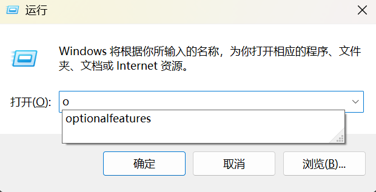
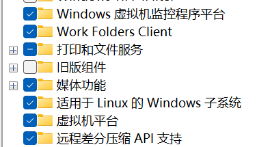
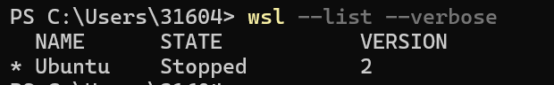
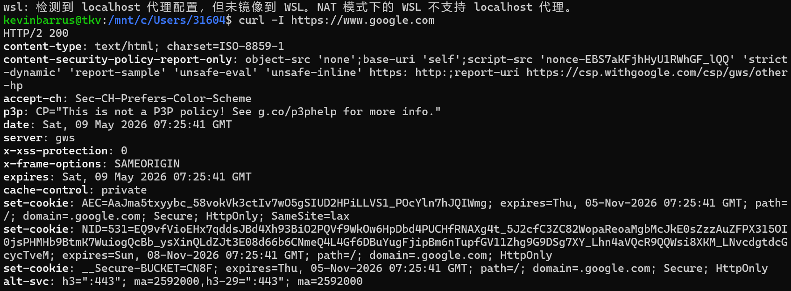

## 步骤 1 - 开启 Windows 相关功能

### 启用适用于 Linux 的 Windows 子系统

方法一：

必须先启用“适用于 Linux 的 Windows 子系统”可选功能，然后才能在 Windows 上安装任何 Linux 分发版。

以管理员身份打开 PowerShell（三种方法：1. 按 win+R，输入 powershell，同时按下Ctrl+Shift，再回车即可进入；2.按下 win 进入开始菜单，搜索 powershell，点击 ”以管理员身份运行“
并输入以下命令：


```PowerShell
dism.exe /online /enable-feature /featurename:Microsoft-Windows-Subsystem-Linux /all /norestart
```

### 启用虚拟机功能

安装 WSL 2 之前，必须启用 **虚拟机平台** 可选功能。 计算机将需要 [虚拟化功能](https://learn.microsoft.com/zh-cn/windows/wsl/troubleshooting#error-0x80370102-the-virtual-machine-could-not-be-started-because-a-required-feature-is-not-installed) 才能使用此功能。

以管理员身份打开 PowerShell 并运行：


```PowerShell
dism.exe /online /enable-feature /featurename:VirtualMachinePlatform /all /norestart
```

**重启** 计算机以完成 WSL 安装和更新到 WSL 2。

方法二：

按 win+R，输入optionalfeatures，按回车进入




勾选 Winodws 虚拟机监控程序平台、适用于 Linux 的 Windows 子系统、虚拟机平台 这三个选项





无论采用方法一还是方法二，执行完之后都要重启电脑


## 步骤 2 - 将 WSL 2 设置为默认版本

打开 PowerShell 并运行以下命令，在安装新的 Linux 分发版时将 WSL 2 设置为默认版本：


``` PowerShell
wsl --set-default-version 2
```


## 步骤 3 - 安装所选 Linux 分发版

打开 [Microsoft Store](ms-windows-store://collection?CollectionId=LinuxDistros) 并选择你喜欢的 Linux 分发版。

这里我们选择 Ubuntu，安装完之后在 PowerShell 中运行以下命令，以进行验证：

```powershell
wsl --list --verbose
```

看到的结果应该是这样：



VERSION 列结果为 2 表示 WSL 2 安装成功

## 步骤 4 - 运行

按 win+R ，输入wsl即可运行


# 代理配置

实现「主机开代理，WSL 自动走代理；主机关代理，WSL 自动直连」，无需手动切换环境变量。

### 推荐方案：Clash Verge 虚拟网卡模式（TUN 模式）

该方案完全绕过 NAT 模式限制，WSL 网络与主机代理状态自动同步，无需手动配置脚本。

#### 步骤 1：Clash Verge 基础设置

1.打开 Clash Verge，进入「设置」页面：
    
    - 开启「允许局域网连接」
    - 确认代理端口（如 `7897`，后续无需手动配置）
    
2.回到首页「网络设置」区域，开启「虚拟网卡模式」（TUN 模式）。


#### 步骤 2：重启 WSL 使配置生效

在 PowerShell 中执行命令，强制关闭所有 WSL 进程：


```PowerShell
wsl --shutdown
```

重新打开 WSL，配置将自动生效。

#### 步骤 3：验证代理连通性

在 WSL 终端执行以下命令，测试谷歌访问：

```bash
curl -I https://www.google.com
```

若返回 `HTTP/2 200` 响应头，说明代理已正常工作，理想情况如图：


